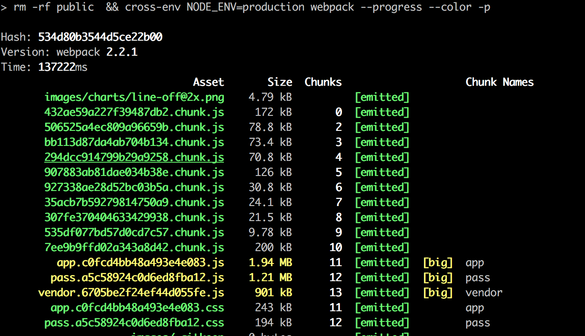
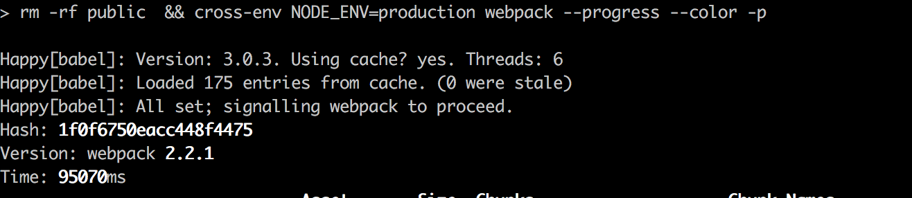
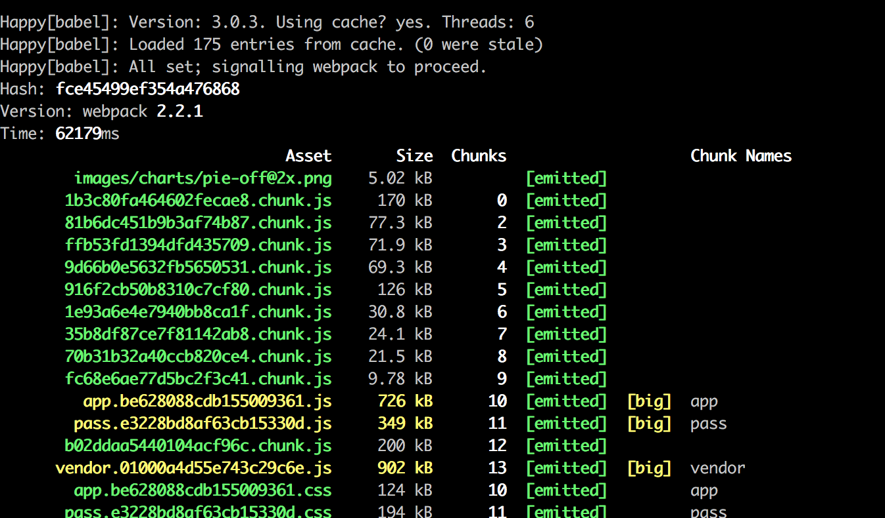

### webpack 性能优化之路
#### 一、本地环境
##### 1、硬件环境

    8 GB 1600 MHz DDR3

    2.6 GHz Intel Core i5

##### 2、运行环境

    node v7.3.0

    npm v3.10.10

    webpack v2.2.1

##### 3、项目未优化时

    大小: 3.4M

    打包情况:

        打包时间为: 137222ms

        大文件:  app.js 为1.94M、pass.js为1.21M、vender.js为0.9M

#### 二、项目优化
Step 1、[happypack](https://github.com/amireh/happypack)

通过多进程模型并行转换多个文件，来加速代码构建。再次构建时将会使用生成的缓存文件，从而提升二次构建的速度。

首次打包时间为：107430ms, 速度提升约22%

二次打包时间为：95070ms, 速度提升约31%

Step 2、[CommonsChunkPlugin](https://webpack.js.org/plugins/commons-chunk-plugin/)

webpack 自带插件, 通过抽取公用代码，减少公用文件的大小。

到Step 1优化之后，我们发现，打包的速度有了极为明显的提升，这个时候我们会想到，那些大文件是否可以继续优化一把，比如我们是否可以把他们的公用文件抽取出来(注: 先前项目中引入的第三方插件配置在entry中的vender)

优化之后，我们发现

二次打包时间为：62179ms, 速度提升约55%

大文件:  app.js 为0.72M、pass.js为0.35M、vender.js为0.9M，大小相对减少 52%

