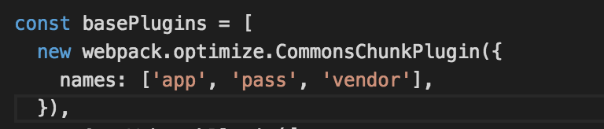

### webpack 性能优化之路
#### 一、本地环境
##### 1、硬件环境

    8 GB 1600 MHz DDR3

    2.6 GHz Intel Core i5

##### 2、运行环境

    node v7.3.0

    npm v3.10.10

    webpack v2.2.1

##### 3、项目未优化时

    大小: 7.6M

    打包情况:

        install时间为: 138s

        打包时间为: 137222ms

        大文件:  app.js 为1.94M、pass.js为1.21M、vender.js为0.9M


#### 二、项目插件优化
##### Step 1、[happypack](https://github.com/amireh/happypack)

通过多进程模型并行转换多个文件,来加速代码构建.再次构建时将会使用生成的缓存文件,从而提升二次构建的速度.

首次打包时间为：107430ms, 速度提升约22%

二次打包时间为：95070ms, 速度提升约31%


##### Step 2、[CommonsChunkPlugin](https://webpack.js.org/plugins/commons-chunk-plugin/)

webpack 自带插件, 通过抽取公用代码,减少公用文件的大小.

到Step 1优化之后,我们发现,打包的速度有了极为明显的提升,这个时候我们会想到,那些大文件是否可以继续优化一把,比如我们是否可以把他们的公用文件抽取出来(注: 先前项目中引入的第三方插件配置在entry中的vender)



优化之后,我们发现

二次打包时间为: 62179ms, 速度提升约55%

大文件:  app.js 为0.72M、pass.js为0.35M、vender.js为0.9M,大小相对减少 52%


##### Step 3、[Manifest File](https://webpack.js.org/guides/code-splitting-libraries/#manifest-file) 缓存优化

Step 2结束之后,我们发现每次生成的vender.js的hash码都不一样,既然作为公用的文件,那么每次生成都应该一样,这样项目再次发布时,浏览器就不用重复性的下载新文件了

 *  PS:官网原文

    But, if we change application code and run webpack again, we see that the hash for the vendor file changes. Even though we achieved separate bundles for vendor and main bundles, we see that the vendor bundle changes when the application code changes. This means that we still don't reap the benefits of browser caching because the hash for vendor file changes on every build and the browser will have to reload the file.

初始打包信息


业务代码改动后代码信息,可以看到vender.js未发生变更


如果想让替代webpack自带的manifest,可以试一下这个 [chunk-manifest-webpack-plugin](https://github.com/soundcloud/chunk-manifest-webpack-plugin)

##### Step 4、[Yarn](https://webpack.js.org/guides/code-splitting-libraries/#manifest-file) install优化
yarn,在使用上和npm没有什么明显区别, 初始目的是解决的npm安装过程中包一致的问题

和npm相比特别之处在于

    1、默认生成的 yarn.lock 文件 用于保证包一致

    2、并行安装, 并有缓存,因而二次安装速度快,并能够离线安装

    3、简洁的输出,对外的api

有一个经验公式

    T总 = T下载依赖 + Twebpack

    Twebpack = Tloaders + Tplugins

yarn首次安装耗时较长,耗时233s, 增加耗时68%


yarn二次安装耗时较长,耗时16.6s, 速度提升约88%


##### Step 5 [ignore-loader](https://github.com/cherrry/ignore-loader)
在我们引用其他人的公用库时,很多文件本身并没有使用到,我们需要忽略掉某些文件或者文件夹的打包.从而减少其他依赖、构建文件大小,以及提升构建速度.

举例,过滤掉了xterm、teminal等依赖,并忽略map文件,减少warning.


##### * Step 6 uglifyJs压缩
uglifyJS凭借基于node开发,压缩比例高,使用方便等诸多优点已经成为了js压缩工具中的首选.

(这一步依据实际需要, 比如进行清除注释、混淆变量等操作时.我们的配置中没有使用,因为uglify导致了项目的打包速度变慢)

提升速度可以使用:
多核并行压缩 [webpack-uglify-parallel](https://github.com/tradingview/webpack-uglify-parallel)

使用多核之后, 打包耗时 198335ms, 相对增加 44%.是Step 4速度提升后的3倍.


##### Step 7 external与alias
1、external 

    简单来说就是将当前依赖声明为一个外部依赖,通过<script>标签引入.这些外部依赖就可以使用第三方加持,从而提升速度.
    但这种方式脱离了整个 bundle.

2、alias 

    简单来说就是直接引用包里面的已处理文件.使得import 'react'就是 import 'react/dist/react.min.js'.
    配合noParse 则会让 webpack 忽略对其进行文件的解析,直接进入最后的 bundle.

我们使用的是第二种方法


#### 三、代码优化

##### Step 1、避免为了小功能而引大lib

1、lodash

我们可以使用 [lodash-cli](https://lodash.com/custom-builds)生成我们需要的方法,如果为了生成方便,可以使用脚本扫码项目所有文件,自动生成.


2、moment

在项目中, 我们可能仅仅会用到format等较为简单的方法,而引入了整个moment,可以尝试一下[fecha](https://github.com/taylorhakes/fecha)

##### Step 2、无效代码的引入
借助 webpack-visualizer-plugin

##### Step 3、[Code Splitting](https://reacttraining.com/react-router/web/guides/code-splitting)
当所有的文件通过入口文件引入时，无疑会导致生成的app.js等文件比较庞大,这个时候我们可以使用 React-Router官网建议的代码分割,从而减少下载文件的大小. (这里我们[升级](https://github.com/ReactTraining/react-router/blob/master/packages/react-router/docs/guides/migrating.md)了一下 react-router到4.1)

*   [v4 官网原文](https://reacttraining.com/react-router/web/guides/code-splitting)

    使用bundle-loader.

    One great feature of the web is that we don’t have to make our visitors download the entire app before they can use it. You can think of code splitting as incrementally downloading the app. While there are other tools for the job, we’ll use Webpack and the bundle loader in this guide..

*   [v3 官网原文](https://github.com/ReactTraining/react-router/blob/v3/docs/guides/DynamicRouting.md)

    使用require.ensure.

    It's important that changes deep down in the application don't require changes all the way up top as well. For example, adding a route to the photo viewer should not affect the size of the initial JavaScript bundle the user downloads. Neither should it cause merge conflicts as multiple teams have their fingers in the same, big route configuration file.

```js

    // router-one.js 大业务组件的routes写法

    import Bundle from './bundle';
    import OneComp from 'bundle-loader?lazy!./one';

    const routes = [
      {
         path: '/demo/one',
         component: props => <Bundle load={OneComp} {...props}></Bundle>,
      },
    ];

    export default routes;


    // router.js
    import getOneRouter from 'router-one';

    ...
    initRoutes() {
      this.routes = [
        { path: '/',
          component: LoginPage,
          exact: true,
        },
        { path: '/console',
          component: ({ routes }) => (
            <PageContainer>
              {routes.map((route, i) => (
                <RouteWithSubRoutes key={i} {...route}/>
              ))}
            </PageContainer>
          ),
          routes: [
            ...getOneRouter,
          ],
        },
      ];
    }

    ...
    render() {
      return (
        <Router history={browserHistory}>
          <Switch>
            {this.routes.map((route, i) => (
              <RouteWithSubRoutes key={i} {...route}/>
            ))}
          </Switch>
        </Router>
      );
    }

    ...
    const RouteWithSubRoutes = (route) => (
      <Route path={route.path} render={props => (
        // pass the sub-routes down to keep nesting
        <route.component {...props} routes={route.routes}/>
      )}
      />
    );
```

 到这一步时,每一次路由访问只会访问对应的组件。(稍微优化一下, 给react-router-dom 建立alias和noParse, 并放在第三方专用vender中).但随着优化和项目进行, 项目本身大小已经由7.6M扩张到 10M迎来了第三个版本的开发.这时我们再来看一下打包情况.
 app.js没有明显的增加, 打包时间没有明显变化, 不过由于引入了新插件,vender.js变大了.
 

##### Step 4、代码分析[webpack-visualizer-plugin](https://github.com/chrisbateman/webpack-visualizer)
项目变庞大之后,使用了codesplit处理,但压缩后的文件，依然比较大，这个时候我们需要借助一下[webpack-visualizer-plugin](https://github.com/chrisbateman/webpack-visualizer)进行代码分析.

 

首先分析一下app.js,超过30k的第三方文件
* 可以看到moment占了183k
* antd占了68k,rc-calendar占了49k, 这个动不了
* lodash只是部分文件, 占了47k
* socketjs-client占了39k
* react-draggable占了35k
* react-grid-layout占了27k
* ...
antd由于是基础的第三方组件,不能动, 而moment是由antd的date-picker组件中引入的, 把他们都移到vender中,并建立alias

 

此时app.js由746k降到了360k,但 vender.js由1M增加到了1.46M

#### 四、gzip优化
